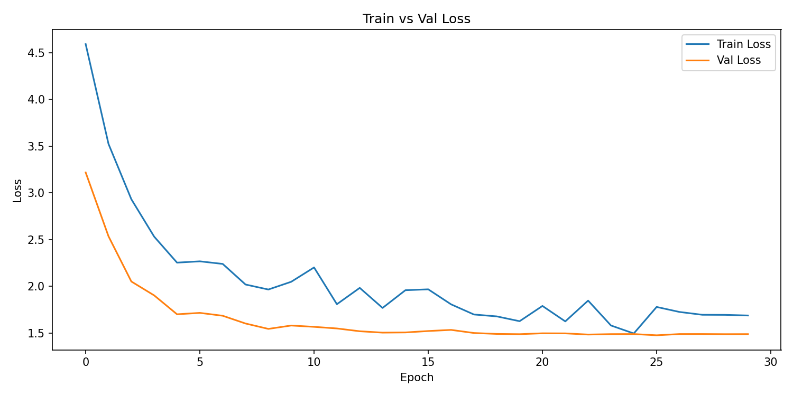

# CSE 144 Final Project Report

**Group Members:**
- Ashwin Senthilvasan (CruzID: assenthi)
- Ido Haiby (CruzID: ihaiby)

## 1. Introduction

### 1. Problem goal and setting.

The task is to classify images into 100 categories using a very small dataset with roughly 10 labeled training images per class (~1,000 total). The goal is to use transfer learning to exceed the baseline test accuracy of 60% on the Kaggle leaderboard. The data is a mixed sample drawn from several different source datasets, so the images vary in subject, resolution, and aspect ratio, and span 100 fine-grained classes with only a handful of examples each. This makes it a low-data, high-class-count problem where training from scratch is not viable.

### 2. Why transfer learning is appropriate.

Training a model from scratch on ~10 images per class would lead to overfitting and produce low accuracy because there is not enough data to learn good low-level features. By starting from a model pretrained on a much larger dataset, we inherit generalizable textures, shapes, and patterns that hopefully transfer well to our classes. We only need to adapt the final 1-2 layers to our 100 categories, which is feasible with limited data and compute.

### 3. Brief summary of your approach and main result.

We fine-tuned a pretrained Vision Transformer (`ViT-B/16`, the `IMAGENET1K_SWAG_E2E_V1` weights from torchvision). We replaced the classifier head with a dropout + linear layer, unfroze the head plus the last encoder block, and trained with AdamW, a cosine-annealing learning-rate schedule, label-smoothed cross-entropy, and a combination of data augmentations plus MixUp and CutMix. This reached 83.6% on the Kaggle public leaderboard, well above the 60% baseline.

## 2. Dataset

### 1. Number of classes and dataset sizes (train/val/test).

This particular dataset had 100 classes with a training size of 1079 labeled images and a testing size of 1036 unlabelled images. These 1079 training images were further split into 864 and 215 training and validation (0.2) splits, respectively.

### 2. Directory structure and label mapping details (ensure labels 0–99 match folders).

The training data follows the standard `torchvision.datasets.ImageFolder` structure: `data/train/<class>/<image>.jpg`, with one subfolder per class. The test images are flat: `data/test/<id>.jpg`.

The important thing to consider is the label ordering. `ImageFolder` assigns class indices by sorting the folder names as strings, so the folders are ordered `"0", "1", "10", "11", ..., "2", "20", ...` which is not numerically. This means the model's output index i does not equal the integer class i. To produce a correct `submission.csv`, we recover the true string label by indexing back into `ImageFolder(...).classes`. This guarantees the submitted label for each image matches the class folder it came from, avoiding the scrambled-label problem described in the instructions.

### 3. Preprocessing (resize, normalization) and data augmentation used.

For this data, we resized everything to 384x384 because the backbone we used was pretrained on images that were of 384x384. This information was found on the PyTorch documentation for the backbone we used (linked at the bottom). Because the backbone was trained on ImageNet, we can use the default mean and standard deviation for normalization (mean = [0.485, 0.456, 0.406], std = [0.229, 0.224, 0.225]) used by all other ImageNet-trained models. Only these two augmentations were applied to the test and validation set, while the training data received the following augmentations.

These other data augmentations I used were RandomHorizontalFlip and a ColorJitter. I used these two because they preserved the actual image reasonably well and avoided large rotations, which might confuse the model with some of the more difficult images. Eventually, I also used PyTorch's Mixup implementation to apply more challenging data augmentation as well.

## 3. Implementation

### 3.1 Model

#### 1. Pretrained backbone used (e.g., ResNet/EfficientNet/ViT) and why.

We used one of PyTorch's pretrained ViT models in our testing of different pretrained models on our dataset. ViT's consistently performed better than other pretrained backbones such as ResNet18 and ResNet50.

#### 2. Architecture changes (classifier head, pooling, dropout, etc.).

We replaced the original ViT head with a new classification head with a dropout layer to further help reduce overfitting, and a linear classification layer to map the pretrained ViT to the 100 classes of our dataset.

#### 3. Fine-tuning strategy (frozen layers, unfreezing schedule).

To fine-tune the model, we tested unfreezing only the FC layer, FC + 1 more layer, and FC + 2 more layers. In all of our tests, FC + 1 more layer performed better than the other two strategies. This is what we use for our final submission as well. We did not try any unfreezing schedules.

### 3.2 Training

#### 1. Loss function and optimizer.

We use a cross entropy loss with label smoothing, to ensure that the model does not become too confident on the small training set, and since there are only about 10 training images per class it prevents the model from memorizing the set. For our optimizer we used the AdamW optimizer as it decouples the weight decay from gradient updates, which leads to improved generalization on pretrained models.

#### 2. Learning rate, scheduler, batch size, epochs, weight decay.

We use an initial learning rate value of 0.0001, with a weight decay of 0.05, along with cosine annealing to schedule our learning rate to gradually reduce the learning rate over the training, improving the stability of our model and allowing the model to converge more smoothly throughout the training. Previous attempts with Step scheduler caused the model to stop learning in the middle of training. During our training we used a batch size of 16 and we trained the model for 30 epochs as we found that going further than 30 epochs caused more overfitting, and led to worse performance.

#### 3. Hardware/software environment (GPU, PyTorch version).

For our environment, we are using RunPod and deploying an RTX A5000 with the following specs and image:

- 1x RTX A5000 (24 GB VRAM)
- Runpod Pytorch 2.4.0
- `runpod/pytorch:2.4.0-py3.11-cuda12.4.1-devel-ubuntu22.04`
- 50 GB RAM
- 9 vCPU (Intel(R) Xeon(R) Gold 6342 CPU @ 2.80GHz)

Our software dependencies are as follows and are tracked by uv:

```
"matplotlib>=3.10.9",
"scikit-learn>=1.8.0",
"tqdm>=4.67.3",
"torch==2.4.0",
"torchvision==0.19.0",
```

A more comprehensive version can be found in our repo in the `.toml` file.

## 4. Experiments

### 1. Baseline setup.

Our baseline for our experiments was a pretrained ViT-B/16 model where the original classification head was replaced by a 100 class linear classifier and only the newly added linear classifier was being trained.

### 2. Hyperparameter tuning plan and validation method.

We split the original training data into 80% train and 20% validation using stratified random sampling to ensure some classes do not get missed during training, and the validation was used to determine the best model checkpoint during the training by saving the model based on best validation accuracy. The hyperparameters that we considered were number of unfrozen layers, learning rate, weight decay, dropout rate, number of epochs, strength of data augmentation. We tested each of the hyperparameters through multiple runs of our model in comparison to previous runs and the baseline run to determine the best hyperparameters in terms of performance. After we determined the best performing hyperparameters by using the ones with the best validation accuracy, we then trained the model on the whole training set to further improve test accuracy by letting the model see more samples.

### 3. Ablations (augmentations, model size, freezing strategy, LR, etc.).

During our experiments, we tested multiple ablations to try to improve performance. We found that keeping the top transformer layer and the classifier head unfrozen led to better accuracy then freezing the entire backbone during training, gaining about 15% in terms of accuracy. We also found that using MixUp and CutMix during training to modify data per batch caused our accuracy to increase compared to non-augmented data, leading to moderate improvement in accuracy of around 3%. After experimenting with our other hyperparameters including dropout rate and learning rate we saw that a learning rate of 0.0001 and a dropout rate of 0.5 had the best model performance, and we saw an increase of 3% in validation accuracy. Our last ablation was to let the model train on the whole training set, without splitting it into validation and training, as this let the model see more examples which would be extremely beneficial due to the small number of samples. By using the whole training dataset we saw an increase of 7% in our test accuracy.

## 5. Results

### 1. Training/validation accuracy (and loss) and any key curves/plots.

We first trained with these hyperparameters with a validation set, getting us an accuracy of ~78% on the validation set and 76% on Kaggle's public tests. After we settled on these hyperparameters, we retrained the model, but did not use a validation set, increasing the training samples the model could use and hoping it would lead to a substantial performance improvement. On this test with the entire training set, we got an accuracy of ~83%, a solid 5% more than with a validation set. The train/val loss of the original model (78% accuracy) can be seen in the plot below.



### 2. Kaggle public leaderboard score


Our final submission reached a public leaderboard score of 0.83636.

## 6. Discussion

### 1. What worked best and why.

We started by using a basic ResNet18 CNN backbone with mostly default settings compared to assignment 2 (augmentation, learning rate scheduler, and optimizer), but quickly reached a point where we couldn't surpass ~68% accuracy. Knowing this, we decided to first swap our backbone to a ViT and see how our performance did. Once we confirmed it was better (getting ~70%), we 'upgraded' each of the hyperparams and data augmentations one-by-one. For example, we started with SGD as the optimizer, then moved to Adam and eventually AdamW. We also did the same for the augmentations, starting only with a normalization and resize, then moving to flips, color jitters, etc.

### 2. Failure cases, overfitting/underfitting observations.

Our main problems with our model was overfitting to the training dataset, along with finding the exact hyperparameters and data augmentations that actually led to better performance. We expected that overfitting would be problem from the start of the project due to the small size of the dataset, but even with implementations to prevent overfitting such as adding data augmentation and using a stratified random split of the training and validation set still produce models that performed significantly better in training and poorly during validation. We also saw that by introducing too many of these data augmentations or if we increased the dropout rate too high our model would actually end up underfitting and producing worse results than even the baseline model. Only after careful tuning of all our hyperparameters were we able to produce a model that did not struggle with overfitting while also consistently getting high accuracy in the train and validation sets.

### 3. Limitations and concrete next improvements.

Some ideas we had to improve the performance are to do more methodical searches for better hyperparameters (e.g., grid search) and also change the loss function to something that works better in low-data environments. One possible loss function that would be better would be Supervised Contrastive loss (https://arxiv.org/abs/2004.11362). Contrastive losses as a whole work well in low-data settings because they create 'new' data, using two forms of every image with multiple strong data augmentations. These two forms are considered a positive pair and are brought together in embedding space by the encoder as training progresses. Supervised contrastive uses these two pairs, plus any other views of images that are of the same class as positive pairs, building on unsupervised contrastive learning. Unfortunately, we did not have time to implement this as it would have required substantial changes to our data preprocessing and loss functions.

## 7. Reproducibility

### 1. Random seeds and determinism settings.

Following the code previously given to us in Assignment 2, we set a random seed to 42, set PyTorch to be deterministic, and ensure the seed is set before loading the data, making the ordering deterministic. Because we enable full deterministic algorithms (`torch.use_deterministic_algorithms(True)`, disabled cuDNN benchmarking and TF32) on top of the fixed seed, repeated runs of `main.py` reproduce identical metrics rather than only similar ones, so the accuracies reported above are stable across runs rather than the result of a single lucky seed.

### 2. Package versions / environment setup steps.

Our package versions can be found in the `.toml` file generated by uv in the GitHub repo. To set up the environment, simply install uv (https://docs.astral.sh/uv/getting-started/installation/) and run `uv sync`, which should download all dependencies into an auto-generated `.venv`. One thing to note about our PyTorch versions is that we use specific, older wheels for the GPU we had. For newer GPUs, a different PyTorch version might provide some speedup. Also, make sure to download the dataset into the data folder in the repo.

### 3. Exact commands to train and to generate submission.csv.

Once the environment is set up, you simply need to run the following commands, which should generate a `model.pth` file and then a `submission.csv` file.

```bash
$ uv run main.py
$ uv run predict.py
```

## 8. Team Contributions

- **Ido Haiby:** Hyperparameter tuning, building the model, report.
- **Ashwin Senthilvasan:** Data augmentations, preprocessing pipeline, report, and documentation work.

## 9. References

Tutorials:

- https://docs.pytorch.org/vision/main/auto_examples/transforms/plot_cutmix_mixup.html
  - This tutorial taught us how to use Mixup without any complicated math using native PyTorch.
- https://docs.pytorch.org/tutorials/beginner/transfer_learning_tutorial.html
  - This was our reference doc for most of the process, specifically the part about learning how to freeze only the fully connected layer as well as the training function, which we adapted a little.
- https://docs.pytorch.org/vision/main/models/generated/torchvision.models.vit_b_16.html
  - This page was to find the right normalization and input sizes for the backbone we used.
